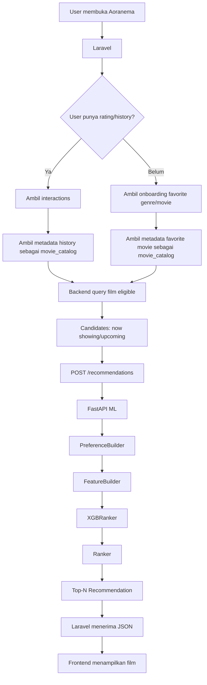
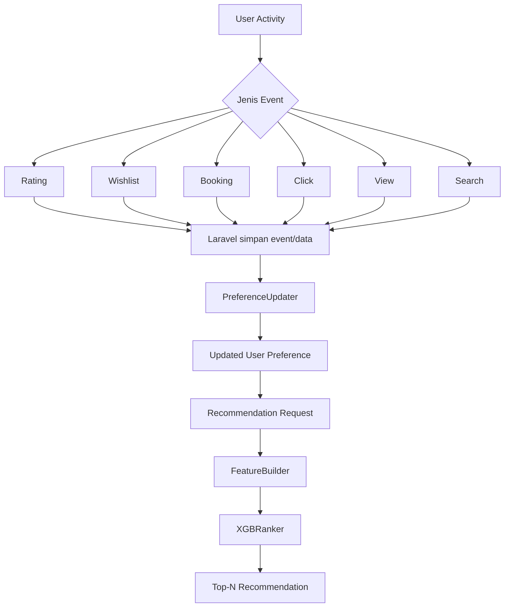

# Penjelasan Integrasi ML Recommendation Aoranema untuk Backend

Dokumen ini dibuat untuk membantu anggota backend yang **belum memahami machine learning** agar bisa menjalankan, mencoba, dan mengintegrasikan service rekomendasi Aoranema dengan benar.

Tujuan utamanya sederhana:

```text
Laravel/backend menyiapkan data user + daftar film
                    ↓
            FastAPI ML menerima data
                    ↓
         ML menghitung preference user
                    ↓
         ML memberi score ke candidate
                    ↓
          ML mengurutkan candidate
                    ↓
          Backend menerima Top-N film
```

Backend **tidak perlu membuka file model, menjalankan notebook, membuat 149 feature, atau mengerti XGBoost secara detail**.

---

# 1. Gambaran Sangat Sederhana

Anggap service ML sebagai **mesin pengurut film**.

Backend memberikan:

```text
1. Siapa user-nya?
2. User suka/tidak suka film apa?
3. Film apa saja yang tersedia untuk direkomendasikan?
```

ML mengembalikan:

```text
1. Film A
2. Film C
3. Film B
4. Film D
...
```

Jadi ML **tidak mengambil alih Laravel**.

Pembagian tugasnya:

```text
Laravel/backend:
- user
- login
- rating
- onboarding
- film
- jadwal
- harga
- booking
- wishlist
- menentukan film yang sedang tersedia
- menampilkan hasil ke frontend

ML/FastAPI:
- membuat preference user
- membuat feature
- menjalankan model
- menghitung recommendation score
- mengurutkan candidate
- mengembalikan ranking
```

---

# 2. Setelah Clone Repository

Misalnya repository sudah di-clone menjadi:

```text
C:\Aoranema
```

Strukturnya kurang lebih:

```text
Aoranema/
├── ...
└── ml/
    ├── api/
    ├── config/
    ├── models/
    ├── notebooks/
    ├── results/
    ├── src/
    ├── tests/
    ├── requirements.txt
    ├── requirements-dev.txt
    └── README.md
```

Masuk ke folder ML:

```powershell
cd C:\Aoranema\ml
```

Pastikan terminal sekarang berada di:

```text
PS C:\Aoranema\ml>
```

---

# 3. Membuat Virtual Environment

Virtual environment digunakan supaya dependency Python untuk ML terpisah dari Python global.

Jalankan:

```powershell
python -m venv .venv
```

Setelah selesai, aktifkan:

```powershell
.\.venv\Scripts\Activate.ps1
```

Kalau berhasil, terminal biasanya berubah menjadi:

```text
(.venv) PS C:\Aoranema\ml>
```

Artinya virtual environment sudah aktif.

---

# 4. Install Dependency

Untuk menjalankan service ML:

```powershell
python -m pip install -r requirements.txt
```

Jika juga ingin menjalankan automated test:

```powershell
python -m pip install -r requirements-dev.txt
```

---

# 5. Test Dulu Sebelum Menjalankan API

Opsional tetapi sangat disarankan.

Masih dari:

```text
C:\Aoranema\ml
```

dan virtual environment aktif:

```powershell
python -m pytest -q tests
```

Jika test gagal, periksa dulu error pada service ML sebelum integrasi ke Laravel.

---

# 6. Menjalankan FastAPI ML

Gunakan terminal pertama.

Pastikan:

```text
1. Sudah berada di C:\Aoranema\ml
2. .venv sudah aktif
```

Lalu jalankan:

```powershell
python -m uvicorn api.main:app --reload --port 8001
```

Jika berhasil, kurang lebih akan muncul:

```text
Uvicorn running on http://127.0.0.1:8001
Application startup complete.
```

**Jangan tutup terminal ini**, karena terminal tersebut sedang menjalankan server ML.

---

# 7. Kalau Membuka Terminal Baru

Virtual environment **tidak otomatis aktif di terminal baru**.

Jadi kalau membuka PowerShell/terminal kedua:

```powershell
cd C:\Aoranema\ml
```

lalu:

```powershell
.\.venv\Scripts\Activate.ps1
```

Baru setelah itu jalankan command Python lain jika diperlukan.

> Browser tidak membutuhkan virtual environment. Jadi untuk membuka Swagger atau health endpoint, cukup buka browser selama FastAPI di terminal pertama masih hidup.

---

# 8. Cek Apakah ML Hidup: `/health`

Buka browser:

```text
http://127.0.0.1:8001/health
```

Endpoint ini berfungsi sebagai **health check**.

Artinya backend bisa bertanya:

> "Service ML hidup dan model berhasil dimuat atau tidak?"

Contoh informasi yang dapat muncul:

```json
{
  "status": "ok",
  "service": {
    "service": "aoranema_movie_recommendation",
    "model": {
      "model_name": "leakage_safe_full_content",
      "feature_count": 149,
      "model_feature_count": 149,
      "scores_are_probabilities": false,
      "ranking_direction": "higher_score_is_better"
    },
    "default_top_k": 10
  }
}
```

Maknanya:

```text
status = ok
→ service ML berhasil hidup

model_name
→ model production yang digunakan

feature_count = 149
model_feature_count = 149
→ jumlah feature dari pipeline dan model cocok

scores_are_probabilities = false
→ recommendation_score BUKAN persen/probability

ranking_direction = higher_score_is_better
→ score lebih tinggi berarti ranking lebih tinggi

default_top_k = 10
→ default jumlah recommendation adalah 10
```

Backend nanti sebaiknya mencoba `/health` terlebih dahulu sebelum menguji `/recommendations`.

---

# 9. Swagger / Dokumentasi API

Buka:

```text
http://127.0.0.1:8001/docs
```

Halaman tersebut dibuat otomatis oleh FastAPI/Swagger.

Di sana ada endpoint seperti:

```text
GET /
GET /health
POST /recommendations
```

Untuk mencoba recommendation:

```text
1. Klik POST /recommendations
2. Klik Try it out
3. Isi Request body
4. Klik Execute
```

---

# 10. Dua Mode Recommendation

Saat ini API mendukung **2 mode**:

```text
history
onboarding
```

## Mode 1 — `history`

Dipakai jika user sudah mempunyai **rating/history**.

Contoh:

```text
Dune          → rating 5.0
Interstellar  → rating 4.5
Film Romance  → rating 2.0
```

ML menggunakan history tersebut untuk membangun preference user.

Flow:

```text
rating user
    ↓
PreferenceBuilder
    ↓
profil user
    ↓
candidate film
    ↓
model
    ↓
ranking
```

## Mode 2 — `onboarding`

Dipakai untuk **user baru** yang belum mempunyai rating/history yang cukup.

Misalnya saat registrasi user memilih:

```text
Genre favorit:
- Action
- Sci-Fi
- Adventure

Film favorit:
- film_id 101
- film_id 205
```

Flow:

```text
favorite genres + favorite movies
                ↓
        initial preference
                ↓
          candidate film
                ↓
               ML
                ↓
             ranking
```

---

# 11. Apa Itu `movie_id`?

`movie_id` adalah **ID unik untuk sebuah film**.

Contoh database backend:

| movie_id | title |
|---:|---|
| 101 | Dune |
| 102 | Interstellar |
| 103 | Barbie |

Jadi jika request berisi:

```json
{
  "movie_id": 101
}
```

artinya film dengan ID 101.

Yang penting adalah **konsisten**.

Untuk production Aoranema, `movie_id` sebaiknya berasal dari **database film milik backend Aoranema**, misalnya `movies.id`.

`tmdb_id` boleh tetap disimpan sebagai metadata eksternal, tetapi jangan mencampurkan arti `movie_id` dan `tmdb_id` tanpa mapping yang jelas.

---

# 12. Apa Itu `candidate`?

`candidate` adalah **film yang saat ini boleh dipertimbangkan untuk direkomendasikan kepada user**.

Contoh database memiliki 5.000 film, tetapi bioskop sekarang hanya mempunyai:

```text
12 film sedang tayang
3 film upcoming yang boleh dipromosikan
```

Maka backend cukup mengirim sekitar 15 film tersebut sebagai:

```text
"candidates": []
```

ML kemudian hanya mengurutkan candidate yang diberikan backend.

Candidate berasal dari **query backend/database Aoranema**, bukan dari ML.

Contoh alurnya:

```text
Database film
     ↓
Laravel query
     ↓
status = now_showing / upcoming
     ↓
film aktif dan eligible
     ↓
candidates
```

---

# 13. Apa Bedanya `movie_catalog` dan `candidates`?

## `movie_catalog`

Berisi metadata film yang diperlukan untuk memahami preference/history user.

Contoh user pernah memberi rating:

```text
Dune = 5
Interstellar = 4.5
Titanic = 2
```

Maka film tersebut perlu ada di:

```text
"movie_catalog": []
```

agar ML bisa membaca genre/metadata film yang membentuk history user.

## `candidates`

Film yang akan **diranking sekarang**.

Misalnya:

```text
Superman
F1
Fantastic Four
Jurassic World
```

Maka film itu masuk:

```text
"candidates": []
```

Ringkasnya:

```text
movie_catalog
= membantu ML memahami user

candidates
= film yang akan dipilih/diurutkan untuk user
```

---

# 14. Real Case Scenario — User Lama

Misalnya user bernama Budi sudah memberi rating:

```text
Dune             = 5.0
Interstellar     = 5.0
The Dark Knight  = 4.5
Film Romance A   = 2.0
Comedy B         = 1.5
```

Backend mengambil:

```text
interactions
= rating/history Budi

movie_catalog
= metadata film yang ada di history Budi

candidates
= film yang sedang tayang/upcoming dan boleh direkomendasikan
```

Kemudian backend mengirim semuanya ke ML.

ML mengurutkan candidates dan mengembalikan Top-N.

---

# 15. Contoh Besar Mode `history`

Di Swagger:

```text
POST /recommendations
→ Try it out
→ Request body
```

Paste:

```json
{
  "mode": "history",
  "interactions": [
    {"movie_id": 101, "rating": 5.0},
    {"movie_id": 102, "rating": 4.5},
    {"movie_id": 103, "rating": 5.0},
    {"movie_id": 104, "rating": 4.0},
    {"movie_id": 105, "rating": 4.5},
    {"movie_id": 106, "rating": 2.0},
    {"movie_id": 107, "rating": 1.5},
    {"movie_id": 108, "rating": 2.5}
  ],
  "movie_catalog": [
    {"movie_id": 101, "title": "Galactic Frontier", "genres": "Action|Adventure|Sci-Fi", "release_year": 2018, "runtime": 148, "original_language": "en"},
    {"movie_id": 102, "title": "Beyond The Stars", "genres": "Adventure|Drama|Sci-Fi", "release_year": 2020, "runtime": 155, "original_language": "en"},
    {"movie_id": 103, "title": "Quantum Assault", "genres": "Action|Sci-Fi|Thriller", "release_year": 2022, "runtime": 137, "original_language": "en"},
    {"movie_id": 104, "title": "The Last Explorer", "genres": "Action|Adventure", "release_year": 2017, "runtime": 129, "original_language": "en"},
    {"movie_id": 105, "title": "Machine Revolution", "genres": "Action|Sci-Fi", "release_year": 2021, "runtime": 142, "original_language": "en"},
    {"movie_id": 106, "title": "Love in December", "genres": "Romance|Drama", "release_year": 2019, "runtime": 111, "original_language": "en"},
    {"movie_id": 107, "title": "Wedding Weekend", "genres": "Comedy|Romance", "release_year": 2020, "runtime": 102, "original_language": "en"},
    {"movie_id": 108, "title": "Family Vacation", "genres": "Comedy|Children", "release_year": 2016, "runtime": 98, "original_language": "en"}
  ],
  "candidates": [
    {"movie_id": 220, "title": "Broken Hearts", "genres": "Drama|Romance", "release_year": 2025, "runtime": 109, "original_language": "en"},
    {"movie_id": 207, "title": "Alien Strike", "genres": "Action|Sci-Fi|Thriller", "release_year": 2026, "runtime": 141, "original_language": "en"},
    {"movie_id": 214, "title": "Weekend Comedy", "genres": "Comedy", "release_year": 2025, "runtime": 95, "original_language": "en"},
    {"movie_id": 201, "title": "Starfall Protocol", "genres": "Action|Adventure|Sci-Fi", "release_year": 2026, "runtime": 151, "original_language": "en"},
    {"movie_id": 218, "title": "The Quiet Room", "genres": "Drama", "release_year": 2024, "runtime": 118, "original_language": "en"},
    {"movie_id": 205, "title": "Cyber Hunter", "genres": "Action|Sci-Fi", "release_year": 2026, "runtime": 133, "original_language": "en"},
    {"movie_id": 224, "title": "Laugh Again", "genres": "Comedy|Romance", "release_year": 2025, "runtime": 101, "original_language": "en"},
    {"movie_id": 211, "title": "Deep Space Rescue", "genres": "Adventure|Sci-Fi|Thriller", "release_year": 2025, "runtime": 145, "original_language": "en"},
    {"movie_id": 203, "title": "Summer Romance", "genres": "Romance", "release_year": 2026, "runtime": 104, "original_language": "en"},
    {"movie_id": 217, "title": "Robot Uprising", "genres": "Action|Sci-Fi|Thriller", "release_year": 2024, "runtime": 138, "original_language": "en"},
    {"movie_id": 209, "title": "Mystery Manor", "genres": "Mystery|Drama", "release_year": 2025, "runtime": 124, "original_language": "en"},
    {"movie_id": 222, "title": "Galaxy Warriors", "genres": "Action|Adventure|Sci-Fi", "release_year": 2025, "runtime": 156, "original_language": "en"},
    {"movie_id": 206, "title": "Family Adventure", "genres": "Adventure|Children|Comedy", "release_year": 2026, "runtime": 106, "original_language": "en"},
    {"movie_id": 215, "title": "Dark Evidence", "genres": "Crime|Mystery|Thriller", "release_year": 2024, "runtime": 127, "original_language": "en"},
    {"movie_id": 202, "title": "Moon Colony", "genres": "Drama|Sci-Fi", "release_year": 2026, "runtime": 139, "original_language": "en"},
    {"movie_id": 225, "title": "Tiny Heroes", "genres": "Animation|Children|Comedy", "release_year": 2026, "runtime": 96, "original_language": "en"},
    {"movie_id": 210, "title": "Warzone Alpha", "genres": "Action|War|Thriller", "release_year": 2026, "runtime": 132, "original_language": "en"},
    {"movie_id": 204, "title": "Office Trouble", "genres": "Comedy", "release_year": 2024, "runtime": 99, "original_language": "en"},
    {"movie_id": 219, "title": "Parallel Earth", "genres": "Adventure|Mystery|Sci-Fi", "release_year": 2026, "runtime": 143, "original_language": "en"},
    {"movie_id": 212, "title": "Forever Yours", "genres": "Drama|Romance", "release_year": 2026, "runtime": 116, "original_language": "en"},
    {"movie_id": 208, "title": "Mars Expedition", "genres": "Adventure|Sci-Fi", "release_year": 2025, "runtime": 149, "original_language": "en"},
    {"movie_id": 223, "title": "Haunted Forest", "genres": "Horror|Mystery|Thriller", "release_year": 2026, "runtime": 113, "original_language": "en"},
    {"movie_id": 216, "title": "Cosmic Gate", "genres": "Action|Adventure|Sci-Fi", "release_year": 2024, "runtime": 146, "original_language": "en"},
    {"movie_id": 221, "title": "Detective Zero", "genres": "Crime|Mystery", "release_year": 2026, "runtime": 121, "original_language": "en"},
    {"movie_id": 213, "title": "Neon City", "genres": "Action|Crime|Sci-Fi|Thriller", "release_year": 2026, "runtime": 136, "original_language": "en"}
  ],
  "top_k": 10,
  "snapshot_year": 2026
}
```

Candidate sengaja **tidak diurutkan** supaya terlihat bahwa ML benar-benar melakukan ranking.

Dengan 25 candidate dan:

```text
"top_k": 10
```

normalnya response berisi:

```text
candidate_count = 25
returned_count = 10
```

Tes yang lebih kuat:

```text
1. Gunakan history yang sama
2. Gunakan candidate yang sama
3. Acak urutan candidates
4. Execute lagi
```

Ranking harus tetap mengikuti score, bukan urutan input.

---

# 16. Real Case Scenario — User Baru

Misalnya user baru bernama Sinta.

Sinta belum pernah memberi rating.

Saat onboarding Sinta memilih:

```text
Favorite genres:
- Animation
- Adventure
- Comedy

Favorite movies:
- movie_id 301
- movie_id 302
- movie_id 303
```

Backend mengambil metadata favorite movies sebagai `movie_catalog`, lalu mengambil film yang sedang tayang sebagai `candidates`.

---

# 17. Contoh Besar Mode `onboarding`

Paste ke Swagger:

```json
{
  "mode": "onboarding",
  "favorite_movie_ids": [301, 302, 303, 304],
  "favorite_genres": [
    "Animation",
    "Adventure",
    "Comedy"
  ],
  "movie_catalog": [
    {"movie_id": 301, "title": "Sky Friends", "genres": "Animation|Adventure|Comedy", "release_year": 2021, "runtime": 105, "original_language": "en"},
    {"movie_id": 302, "title": "Dragon Journey", "genres": "Animation|Adventure|Fantasy", "release_year": 2020, "runtime": 112, "original_language": "en"},
    {"movie_id": 303, "title": "Funny Explorers", "genres": "Adventure|Comedy|Children", "release_year": 2022, "runtime": 101, "original_language": "en"},
    {"movie_id": 304, "title": "Robot Family", "genres": "Animation|Comedy|Sci-Fi", "release_year": 2023, "runtime": 108, "original_language": "en"}
  ],
  "candidates": [
    {"movie_id": 420, "title": "Broken Promise", "genres": "Drama|Romance", "release_year": 2026, "runtime": 118, "original_language": "en"},
    {"movie_id": 407, "title": "Jungle Pals", "genres": "Animation|Adventure|Comedy", "release_year": 2026, "runtime": 104, "original_language": "en"},
    {"movie_id": 414, "title": "Cold Evidence", "genres": "Crime|Thriller", "release_year": 2026, "runtime": 126, "original_language": "en"},
    {"movie_id": 401, "title": "Magic Island", "genres": "Animation|Adventure|Fantasy", "release_year": 2026, "runtime": 111, "original_language": "en"},
    {"movie_id": 418, "title": "Quiet Drama", "genres": "Drama", "release_year": 2025, "runtime": 121, "original_language": "en"},
    {"movie_id": 405, "title": "Funny Robots", "genres": "Animation|Comedy|Sci-Fi", "release_year": 2026, "runtime": 106, "original_language": "en"},
    {"movie_id": 424, "title": "Romantic Weekend", "genres": "Comedy|Romance", "release_year": 2025, "runtime": 103, "original_language": "en"},
    {"movie_id": 411, "title": "Treasure Kids", "genres": "Adventure|Children|Comedy", "release_year": 2026, "runtime": 99, "original_language": "en"},
    {"movie_id": 403, "title": "Summer Love", "genres": "Romance", "release_year": 2026, "runtime": 110, "original_language": "en"},
    {"movie_id": 417, "title": "Pixel Heroes", "genres": "Animation|Adventure|Comedy", "release_year": 2025, "runtime": 102, "original_language": "en"},
    {"movie_id": 409, "title": "Detective Night", "genres": "Crime|Mystery", "release_year": 2026, "runtime": 120, "original_language": "en"},
    {"movie_id": 422, "title": "Galaxy Family", "genres": "Animation|Adventure|Sci-Fi", "release_year": 2025, "runtime": 113, "original_language": "en"},
    {"movie_id": 406, "title": "Little Explorers", "genres": "Adventure|Children|Comedy", "release_year": 2026, "runtime": 97, "original_language": "en"},
    {"movie_id": 415, "title": "Dark House", "genres": "Horror|Mystery|Thriller", "release_year": 2025, "runtime": 116, "original_language": "en"},
    {"movie_id": 402, "title": "Dream Factory", "genres": "Animation|Comedy|Fantasy", "release_year": 2026, "runtime": 107, "original_language": "en"},
    {"movie_id": 425, "title": "Tiny Adventurers", "genres": "Animation|Children|Adventure", "release_year": 2026, "runtime": 94, "original_language": "en"},
    {"movie_id": 410, "title": "Battle Zone", "genres": "Action|War|Thriller", "release_year": 2026, "runtime": 134, "original_language": "en"},
    {"movie_id": 404, "title": "Office Laughs", "genres": "Comedy", "release_year": 2025, "runtime": 98, "original_language": "en"},
    {"movie_id": 419, "title": "Moon Adventure", "genres": "Adventure|Animation|Sci-Fi", "release_year": 2026, "runtime": 109, "original_language": "en"},
    {"movie_id": 412, "title": "Forever Together", "genres": "Drama|Romance", "release_year": 2026, "runtime": 115, "original_language": "en"}
  ],
  "top_k": 10,
  "snapshot_year": 2026
}
```

Di contoh ini:

```text
candidate_count = 20
top_k = 10
```

jadi normalnya:

```text
returned_count = 10
```

---

# 18. Setelah Klik `Execute`

Swagger menampilkan:

```text
Server response
```

Kalau berhasil:

```text
Code: 200
```

Lalu ada:

```text
Response body
```

Contoh:

```json
{
  "recommendations": [
    {
      "movie_id": 407,
      "title": "Jungle Pals",
      "rank": 1,
      "recommendation_score": -0.82
    },
    {
      "movie_id": 401,
      "title": "Magic Island",
      "rank": 2,
      "recommendation_score": -1.13
    }
  ],
  "candidate_count": 20,
  "returned_count": 10,
  "model_name": "leakage_safe_full_content",
  "profile_source": "onboarding",
  "warnings": []
}
```

**Response body inilah hasil aktual request.**

---

# 19. Arti `recommendation_score`

Contoh:

```text
Film A = -0.82
Film B = -1.13
Film C = -2.50
```

Karena:

```text
-0.82 > -1.13 > -2.50
```

maka:

```text
Film A rank 1
Film B rank 2
Film C rank 3
```

Score boleh negatif.

`recommendation_score` **bukan persentase**.

Backend cukup menggunakan `rank` untuk urutan tampilan.

---

# 20. Bagian `Responses 200 / 422` di Bawah Swagger

Swagger juga menampilkan bagian dokumentasi:

```text
Responses
```

Biasanya ada:

```text
200
422
```

Bagian ini **bukan hasil aktual request**.

Ini adalah dokumentasi schema.

## `200`

Artinya:

```text
jika request berhasil,
response akan memiliki bentuk seperti schema tersebut
```

Nilai contoh seperti:

```text
movie_id = 0
model_name = "string"
```

hanya placeholder dokumentasi.

## `422`

Artinya request tidak valid.

Contoh:

```text
rating = 9
top_k = 0
movie_id history tidak ada di movie_catalog
duplicate candidate
mode onboarding tanpa favorite genre/movie
```

Jadi:

```text
Server response → Response body
= hasil request asli

Responses 200 / 422 di bawah
= dokumentasi kemungkinan bentuk response
```

Jika Swagger menampilkan `additionalProp1`, itu hanya karena candidate boleh membawa field tambahan seperti `poster_url`, `price`, atau `schedule`.

---

# 21. Flowchart Integrasi Awal



Versi teks:

```text
USER
 ↓
LARAVEL
 ↓
punya history?
 ├─ YA → mode=history
 └─ TIDAK → mode=onboarding
 ↓
movie_catalog
+
candidates
 ↓
POST /recommendations
 ↓
ML
 ↓
TOP-N
 ↓
LARAVEL
 ↓
FRONTEND
```

---

# 22. Yang Harus Dilakukan Backend agar ML Terintegrasi

## Step 1 — Tambahkan URL ML

Di `.env` Laravel:

```env
ML_API_URL=http://127.0.0.1:8001
```

Contoh `config/services.php`:

```php
'ml' => [
    'url' => env('ML_API_URL', 'http://127.0.0.1:8001'),
],
```

## Step 2 — Buat `RecommendationService` di Laravel

Misalnya:

```text
app/Services/RecommendationService.php
```

Tugasnya:

```text
- mengirim payload ke ML
- menerima response
- menangani timeout/error
```

Konsep request:

```php
$response = Http::timeout(15)
    ->post(
        config('services.ml.url') . '/recommendations',
        $payload
    );
```

## Step 3 — Test Laravel → `/health`

```text
Laravel
 ↓
GET http://127.0.0.1:8001/health
```

Jika `200` dan `status=ok`, Laravel sudah bisa berkomunikasi dengan ML.

## Step 4 — Mapping Database Backend

Backend perlu menentukan sumber data berikut:

```text
user
movie_id
rating
favorite genres
favorite movies
movie metadata
film sedang tayang/upcoming
```

Contoh:

```text
ratings table
→ interactions

movies table untuk film history
→ movie_catalog

movies + schedules/status/release
→ candidates
```

## Step 5 — Buat Payload `history`

Jika user punya rating:

```text
interactions
movie_catalog
candidates
top_k
snapshot_year
```

## Step 6 — Buat Payload `onboarding`

Jika user baru:

```text
favorite_movie_ids
favorite_genres
movie_catalog
candidates
top_k
snapshot_year
```

## Step 7 — Tampilkan Response

Gunakan:

```text
recommendations
```

dan tampilkan berdasarkan:

```text
rank
```

## Step 8 — Error Handling

Backend harus menangani:

```text
200
→ sukses

422
→ payload backend salah/tidak lengkap

500
→ ML internal error

timeout / connection refused
→ ML tidak tersedia
```

Jika ML down, website sebaiknya tetap hidup dengan fallback seperti film populer, terbaru, atau sedang tayang.

---

# 23. Real Integration Scenario

Saat halaman `Recommended For You` dibuka:

```text
1. Ambil user_id dari login/session
2. Cari rating user
3. Jika ada rating → mode=history
4. Jika belum → mode=onboarding
5. Ambil metadata film yang dibutuhkan
6. Query film eligible sebagai candidates
7. Bentuk JSON
8. POST ke FastAPI
9. Terima rankings
10. Tampilkan poster/jadwal/harga dari Laravel/frontend
```

ML tidak menangani:

```text
seat availability
cinema branch
ticket price
payment
booking checkout
poster rendering
```

---

# 24. Tentang `PreferenceUpdater` yang Akan Dibuat Setelah Integrasi Dasar

Integrasi awal menggunakan:

```text
rating/history
onboarding
```

Setelah Laravel ↔ ML berhasil end-to-end, akan dibuat `PreferenceUpdater`.

Event yang direncanakan:

```text
wishlist
booking
click
search
view
```

Tetapi event tersebut **harus dicatat oleh backend**.

ML tidak bisa mengetahui user klik/wishlist/booking jika backend tidak menyimpannya.

---

# 25. Pembagian Tugas untuk Preference Updater

Backend:

```text
mencatat APA yang dilakukan user
```

ML:

```text
menentukan bagaimana event tersebut memengaruhi preference
```

Contoh:

```text
User klik Dune
 ↓
Laravel menyimpan:
user_id = 12
movie_id = 501
event_type = click
 ↓
PreferenceUpdater
 ↓
profil user diperbarui
```

Backend tidak perlu menghitung sendiri:

```text
Sci-Fi +0.2
director +0.1
cast +0.05
```

Itu logic ML nanti.

---

# 26. Arti Event yang Akan Dipertimbangkan

```text
Rating
→ explicit preference; user langsung memberi nilai

Wishlist
→ user menunjukkan minat, tetapi belum tentu suka

Booking
→ strong behavioral interest, tetapi belum tentu sama dengan rating 5

Click
→ signal minat yang lebih lemah

View
→ user membuka/melihat detail film

Search
→ contextual signal; bisa ambigu dan belum tentu preference permanen
```

Jangan langsung membuat aturan sembarangan seperti:

```text
click = rating 3
wishlist = rating 4
booking = rating 5
```

Bobot/aturan akan ditentukan dan diuji pada `PreferenceUpdater`.

---

# 27. Data Event yang Sebaiknya Disiapkan Backend

Contoh konseptual:

```text
user_movie_events
```

Kolom:

```text
id
user_id
movie_id
event_type
created_at
```

Contoh:

```text
1 | 12 | 501 | click        | ...
2 | 12 | 501 | wishlist_add | ...
3 | 12 | 501 | booking      | ...
4 | 12 | 700 | view         | ...
```

Search mungkin lebih cocok disimpan terpisah karena bisa berupa query text:

```text
user_search_events
```

Struktur final harus disesuaikan dengan database backend yang sebenarnya.

---

# 28. Future Flow Setelah PreferenceUpdater



Versi teks:

```text
rating / wishlist / booking / click / view / search
                      ↓
              Laravel menyimpan
                      ↓
             PreferenceUpdater
                      ↓
              preference user
                      ↓
               ML ranking
                      ↓
              recommendation
```

---

# 29. Yang Harus Backend Kerjakan Sekarang vs Nanti

## Sekarang

```text
[ ] Clone/pull repo
[ ] Setup .venv
[ ] Install requirements
[ ] Jalankan FastAPI
[ ] Buka /health
[ ] Buka /docs
[ ] Test mode history
[ ] Test mode onboarding
[ ] Tambahkan ML_API_URL ke Laravel
[ ] Laravel berhasil GET /health
[ ] Mapping database → payload
[ ] Laravel berhasil POST /recommendations
[ ] Tampilkan ranking ke frontend
[ ] Buat fallback jika ML down
```

## Nanti setelah integrasi dasar berhasil

```text
[ ] Audit struktur database event
[ ] Buat PreferenceUpdater
[ ] Hubungkan rating update
[ ] Tambahkan wishlist signal
[ ] Tambahkan booking signal
[ ] Tambahkan click signal
[ ] Tambahkan view signal
[ ] Tambahkan search signal jika berguna
[ ] Test dampak event terhadap recommendation
```

---

# 30. Yang Backend Tidak Perlu Lakukan

Backend **tidak perlu**:

```text
- menjalankan notebook training
- training ulang model
- membuka file XGBoost JSON
- membuat 149 feature
- install XGBoost ke Laravel/PHP
- menghitung recommendation_score sendiri
- menentukan ranking sendiri
- mengubah score menjadi percentage
```

Backend cukup:

```text
ambil data
 ↓
buat payload
 ↓
HTTP POST
 ↓
terima ranking
 ↓
tampilkan
```

---

# 31. Kesalahan Umum yang Harus Dihindari

```text
SALAH:
"Kasih link model JSON ke Laravel."

BENAR:
Laravel memanggil FastAPI.


SALAH:
"ML mencari sendiri film yang sedang tayang."

BENAR:
Laravel menentukan candidate.


SALAH:
"recommendation_score 0.8 berarti 80% cocok."

BENAR:
Score hanya dipakai untuk ranking.


SALAH:
"Setiap request retrain model."

BENAR:
Model final tetap; input/profile user yang berubah.


SALAH:
"Wishlist otomatis rating 5."

BENAR:
Wishlist adalah signal berbeda dan akan diproses PreferenceUpdater nanti.
```

---

# 32. Checklist Pengujian Manual Backend

```text
Test 1:
GET /health
→ harus 200 dan status ok

Test 2:
POST /recommendations mode=history
→ harus 200 dan recommendations terisi

Test 3:
POST /recommendations mode=onboarding
→ harus 200 dan profile_source onboarding

Test 4:
Kirim 20+ candidate dengan top_k=10
→ candidate_count > returned_count
→ returned_count = 10

Test 5:
Acak urutan candidate
→ ranking tetap mengikuti score, bukan urutan input

Test 6:
Kirim request salah, misalnya top_k=0
→ harus mendapat validation error 422
```

---

# 33. Ringkasan Super Singkat

```text
1. cd C:\Aoranema\ml
2. aktifkan .venv
3. install requirements
4. jalankan uvicorn port 8001
5. cek /health
6. buka /docs
7. test POST /recommendations
8. history = user yang sudah punya rating
9. onboarding = user baru
10. movie_catalog = metadata untuk memahami user
11. candidates = film yang mau diranking
12. candidate berasal dari backend
13. Laravel POST JSON ke ML
14. ML mengembalikan rank
15. Laravel menampilkan hasil
```

Arsitektur tahap pertama:

```text
DATABASE LARAVEL
      ↓
RecommendationService Laravel
      ↓
     JSON
      ↓
FastAPI ML /recommendations
      ↓
PreferenceBuilder
      ↓
FeatureBuilder
      ↓
XGBRanker
      ↓
Ranker
      ↓
Top-N JSON
      ↓
Laravel
      ↓
Frontend
```

Tahap berikutnya:

```text
wishlist
booking
click
view
search
   ↓
PreferenceUpdater
   ↓
updated preference
   ↓
recommendation yang lebih adaptif
```

---

# 34. Urutan Pengerjaan yang Disarankan

```text
TAHAP 1
FastAPI hidup
    ↓
/health berhasil

TAHAP 2
Swagger history berhasil
    ↓
Swagger onboarding berhasil

TAHAP 3
Laravel → /health berhasil

TAHAP 4
Laravel → /recommendations berhasil

TAHAP 5
Recommendation tampil di frontend

TAHAP 6
Error handling + fallback

TAHAP 7
PreferenceUpdater

TAHAP 8
Wishlist / Booking / Click / View / Search
```

Dengan urutan ini, jika terjadi error kita tahu error berada di tahap mana dan tidak perlu membongkar seluruh sistem sekaligus.
